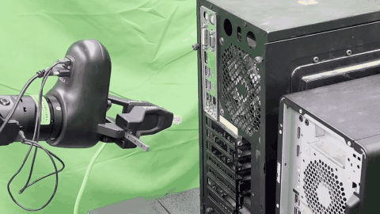

# openpi-RLT

`openpi-RLT` is an openpi-based reproduction of **RL Token (RLT)** for
real-robot online reinforcement learning. It keeps the upstream
[openpi](https://github.com/Physical-Intelligence/openpi) VLA training and
inference stack, then adds the RLT token module, policy-serving path, replay
runtime, actor-critic learner, and real-robot rollout tools needed to run RLT
end to end.

To the best of our knowledge, openpi-RLT is the first open-source,
openpi/pi0.5-based real-robot reproduction of the RLT-style pipeline,
demonstrated on Ethernet insertion with RL-token adaptation, frozen VLA
reference serving, online actor-critic learning, replay, rollout, and
evaluation.

## Real-Robot Results

The first clip is the frozen VLA baseline; the second clip is the RLT policy
after online training.

<p align="center"><strong>Frozen VLA Baseline</strong></p>

<p align="center">
  
</p>

<p align="center"><strong>RLT Policy</strong></p>

<p align="center">
  
</p>

High-resolution MP4s are also available:
[VLA baseline](media/ethernet_vla_baseline.mp4) and
[RLT policy](media/ethernet_rlt_policy.mp4).

## Core Components

The upstream openpi layout is preserved. This section highlights the main
RLT-specific additions and modified entry points that make up openpi-RLT.

| Component | Path | Role |
| --- | --- | --- |
| RL-token model integration | `src/openpi/models/rl_token.py`, `src/openpi/models/pi0.py` | Adds the RL-token encoder/decoder and pi0/pi0.5 hooks used by the RLT policy. |
| Training entry points | `src/openpi/training/config.py`, `scripts/train_rlt.py` | Registers RLT configs and launches stage-1 RL-token training. |
| Remote policy serving | `scripts/serve_rlt_policy.py`, `packages/openpi-client/` | Serves frozen VLA references and compact RLT features to the online RL runtime. |
| Deployment policy adapter | `src/openpi/policies/agilexbag_image_policy.py` | Adapts image observations and action chunks for deployment. |
| Online RL runtime | `rlt_online_rl/src/rlt_online_rl/` | Contains actor, critic, learner, replay, inference, and rollout-side runtime modules. |
| Experiment launch and configs | `rlt_online_rl/launch/`, `rlt_online_rl/configs/` | Provides launch scripts and runtime configs for experiments such as Ethernet insertion. |
| Robot interface bridge | `rlt_online_rl/train_deploy_alignment/` | Connects the online RL runtime with real-robot control and signal interfaces. |
| Replay and analysis tools | `rlt_online_rl/scripts/` | Includes offline replay inspection, replay export, and experiment utilities. |
| Demo assets and notes | `media/`, `docs/` | Stores README media assets and focused setup notes. |

Detailed runtime instructions live in
[rlt_online_rl/README.md](rlt_online_rl/README.md), and package internals are
summarized in
[rlt_online_rl/src/rlt_online_rl/README.md](rlt_online_rl/src/rlt_online_rl/README.md).

## Getting Started

Clone the repository and install the openpi/RLT stack from the repository root:

```bash
git clone https://github.com/Yyshadow/openpi-RLT.git
cd openpi-RLT
uv sync
uv pip install -e .
```

RLT training configs are registered in
[`src/openpi/training/config.py`](src/openpi/training/config.py). A typical
stage-1 command looks like:

```bash
uv run scripts/train_rlt.py rlt_pi05_agilexbag_image_delta_joint \
  --exp-name <run-name> \
  --overwrite
```

After a trained checkpoint is available, serve the frozen VLA/RLT policy with:

```bash
python scripts/serve_rlt_policy.py \
  --config rlt_pi05_agilexbag_image_delta_joint \
  --checkpoint-dir <checkpoint-dir> \
  --port 8000
```

For the real-robot online RL launch order, keyboard controls, replay semantics,
and eval-only rollout flow, follow
[rlt_online_rl/README.md](rlt_online_rl/README.md).

## Relationship to Upstream Work

This project follows the RLT recipe from **RL Token: Bootstrapping Online RL
with Vision-Language-Action Models** and uses openpi's pi0.5 as the base VLA
stack. The RLT-specific additions in this fork are layered on top of upstream
openpi rather than replacing it with another backbone.

Key implementation pieces include:

- RL-token encoder/decoder modules and pi0.5 integration.
- RL-token training with an optional supervised VLA fine-tuning term.
- Frozen VLA policy serving that returns reference action chunks and compact
  RL-token features.
- A lightweight online actor-critic runtime for chunk-level action refinement.
- Real-robot replay collection, episode finalization, human-intervention
  handling, and eval-only rollout support.

## Contributors

Core contributors are listed in contribution order:

Yi Yang<sup>*</sup>, Huaihang Zheng<sup>*</sup>, Kai Ma<sup>*†</sup>, Tian Xie, Guozheng Li, Shenglin Xu,
Xiangyu Wang, Yiren Ma, Baoxu Liu<sup>†</sup>

<sub>* Equal contribution. † Project lead.</sub>

## Citation

Please cite this repository, the original RLT paper, and openpi when using this
code in your work.

```bibtex
@misc{openpi_rlt_2026,
  title = {openpi-RLT: Real-Robot RLT Reproduction on openpi},
  author = {Yi Yang and Huaihang Zheng and Kai Ma and Tian Xie and Guozheng Li and Shenglin Xu and Xiangyu Wang and Yiren Ma and Baoxu Liu},
  year = {2026},
  note = {Open-source real-robot reproduction of RL Token (RLT) built on openpi.}
}
```

## Acknowledgements

This repository builds on
[openpi](https://github.com/Physical-Intelligence/openpi) from Physical
Intelligence and follows the RLT paper
[RL Token: Bootstrapping Online RL with Vision-Language-Action Models](https://pi.website/research/rlt).

## License

See [LICENSE](LICENSE) and [LICENSE_GEMMA.txt](LICENSE_GEMMA.txt).
