# RLT 理论基础与本仓库工程实现梳理

这份文档的目标不是重复 README，而是把两件事说清楚：

1. RLT 在论文里的核心方法到底是什么，为什么它适合真实机器人上的快速在线强化学习。
2. 这套方法在本仓库里是如何落地的，代码入口在哪里，数据和参数怎样流动，哪些地方是对论文方案的工程化改写。

阅读时建议始终区分两个层面：

- 论文原始方法：以 *RL Token: Bootstrapping Online RL with Vision-Language-Action Models* 为准。
- 本仓库实现：一个基于 openpi、面向真实机器人部署的 RLT 复现版本，保留了论文主干思路，但在底座模型、控制频率、回放构造和训练稳定化细节上做了适配。

## 一、RLT 的理论基础

### 1. 问题背景：为什么 VLA 还需要在线 RL

论文讨论的对象是 VLA（Vision-Language-Action）模型。它的强项是泛化能力强，能从大规模示教数据里学到“看懂场景、理解任务、给出大致动作”的能力；它的短板是精密接触阶段常常不够快、不够狠、不够稳。典型表现包括：

- 最后几毫米对位时动作犹豫，速度慢。
- 接触后会试探、停顿、重复修正。
- 示教数据本身不够稳定，导致高精度动作学得不够扎实。

如果直接用在线 RL 去微调整个大模型，通常会遇到两个现实问题：

- 计算太重，真实机器人上很难做到“几分钟到几小时内见效”。
- 样本效率不够，机器人回合成本又很高。

RLT 的基本立场很明确：不要让 RL 重新学一套视觉和任务理解，而是让 VLA 继续承担“看”和“给出一个不错的参考动作”，RL 只负责围绕这个参考动作做快速精修。

下图可以把论文的出发点压缩成一句话：VLA 负责提供强先验，RL 负责改进最难、最精密的那一段动作。

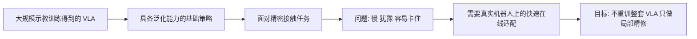

### 2. RLT 的核心想法：把大模型知识压成一个可用于在线 RL 的接口

RLT 解决的关键不是“怎么再加一个 actor-critic”，而是“怎么从 VLA 里拿出一个足够有用、又足够轻量的状态表示”。

论文给出的答案是 RL token：

- 从 VLA 内部最后一层表征里读出一个紧凑表示。
- 这个表示保留任务相关信息，但维度足够小，可以喂给轻量级 actor 和 critic。
- 在线 RL 只训练小网络，不去更新整套 VLA。

所以 RLT 的结构可以概括成三层分工：

- 冻结的 VLA：提供视觉语义理解和参考动作。
- RL token 模块：把 VLA 内部表征压缩成适合 RL 的状态向量。
- 轻量 actor-critic：在真实机器人回放数据上做高样本效率的在线更新。

这也是论文标题里 “Bootstrapping Online RL with VLA Models” 的含义：RL 不是从零开始，而是站在 VLA 已有能力之上启动。

下面这张图是根据论文总框架重绘的简化版：

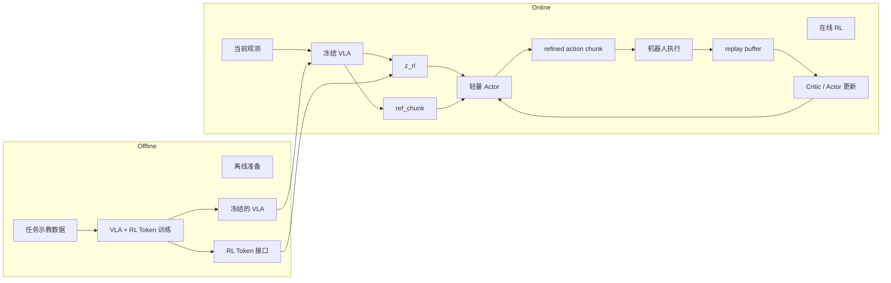

### 3. RL token 是怎么训练出来的

论文并不是随便从 VLA 某一层拿一个 embedding 直接给 RL 用，而是专门训练了一个 encoder-decoder 结构，让 RL token 成为一个“信息瓶颈”。

做法可以分成四步：

1. 先用 VLA 对输入观测做前向，得到最后一层 token embeddings。
2. 在这串 embeddings 后面拼一个可学习的特殊 token，也就是 `<rl>`。
3. 用一个轻量 encoder 处理整串 token，取 `<rl>` 位置的输出作为 `z_rl`。
4. 用 decoder 从 `z_rl` 自回归重建原始的 VLA embeddings，并用重建误差训练。

论文的用意很直接：

- 如果 `z_rl` 太弱，decoder 无法恢复原来的 VLA 表征。
- 如果 `z_rl` 能支撑重建，它就必须保留相当一部分任务相关信息。

因此 RL token 不是“额外监督得到的标签特征”，而是“通过重建 VLA 内部表征得到的压缩接口”。

论文给出的训练目标是：

- `L_ro`：重建原始 VLA embeddings 的误差。
- `alpha * L_vla`：可选的 VLA 监督微调项。

其中有两个细节很重要：

- 重建目标对原始 VLA embeddings 使用 stop-gradient，避免 RL token 训练把目标本身拖着一起变。
- `alpha=0` 时只训练 RL token 模块；`alpha>0` 时可以连同 VLA 一起做少量任务特化微调。

这一段如果只看文字容易抽象，建议直接看信息流：

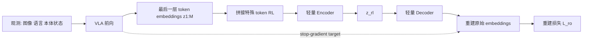

### 4. 在线 RL 的状态、动作与奖励定义

论文里的在线 RL 不是单步控制，而是 chunk 级控制。

#### 状态

在线 RL 的状态不是原始图像，也不是整个 VLA 的隐藏状态，而是：

- `z_rl`：RL token 压缩表示。
- `s_p`：额外本体状态，例如关节位置、速度、末端位姿等。

即 `x = (z_rl, s_p)`。

这背后的考虑是：

- `z_rl` 提供任务相关的高层感知与语义信息。
- 本体状态补上闭环控制所需的低层几何量。

#### 动作

动作是一个 action chunk，而不是单步动作。

论文区分了两个长度：

- `H`：VLA 原生输出的动作 chunk 长度。
- `C`：RL 使用的 chunk 长度，通常取 `C < H`，让 RL 更灵活、更高频地修正。

用 chunk 而不是单步动作，有三个直接收益：

- 降低有效决策步数，缓解稀疏奖励下的 credit assignment。
- 与 VLA 的原生接口对齐，避免再发明一套动作抽象。
- 让 RL 学的是“短时段的局部精修”，而不是每个控制 tick 都从头决策。

#### 奖励

论文里最核心的设定是稀疏终局奖励：

- 成功时给 `r_T = 1`
- 失败时给 `r_T = 0`

这很符合真实机器人场景：很多任务确实很难设计稳定的 dense reward，最终只能依赖人工打成功/失败标签。

### 5. Critic 学什么

RLT 使用标准的离策略 actor-critic 思路，critic 估计 chunk 级动作价值：

- 输入：当前状态 `x` 和一个动作 chunk `a_{1:C}`
- 输出：`Q(x, a_{1:C})`

论文用的是 TD3 风格的 twin critic。原因也很常见：

- 真实机器人数据少、噪声大。
- 单 Q 容易高估。
- 双 Q 取最小值更稳。

论文中的 critic 目标本质上是 chunk 版 TD backup：

- 把当前 chunk 内的奖励折扣求和。
- 再加上下一状态下、由 target actor 采样动作得到的 bootstrap value。

这一步决定了 critic 学到的是：

- “当前这个状态下，执行这样一段短动作，最终值不值”

而不是只评价某一个孤立的关节增量。

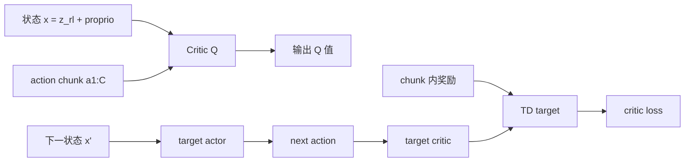

### 6. Actor 学什么

RLT 的 actor 不是从状态直接无条件地产生动作，而是条件在 VLA 参考动作之上：

- 输入：`x` 和 VLA 给出的参考 chunk `a_tilde`
- 输出：一个高斯分布 `pi_theta(a | x, a_tilde)`

这件事非常关键。它意味着 actor 的角色不是“另起炉灶”，而是“改稿”：

- VLA 先给出一个大致正确的方案。
- actor 在这个方案附近做局部优化。

论文这样设计有两层原因。

第一层是样本效率：

- 直接在高维 chunk 空间里探索很贵。
- 如果已经有一个不错的参考动作，RL 只需要学会如何偏离它，而不是重建整个行为。

第二层是多模态：

- VLA 的动作分布可能有多个合理模式。
- 直接训练一个固定方差的高斯 actor，很难自己恢复这些模式。
- 把 VLA 采样出来的参考 chunk 作为条件输入，相当于把“当前正在走哪一种模式”也传给了 actor。

### 7. BC 正则为什么是必要的

论文里的 actor 目标不是纯粹最大化 Q，还包含一个对参考动作的二范数约束。直觉上可以理解为：

- Q 项负责“往更高回报方向走”。
- BC 正则负责“不要离 VLA 这个先验太远”。

如果没有这个约束，actor 一开始只能依赖一个还不成熟的 critic 去探索高维动作空间，训练很容易发散，或者学出完全不可执行的动作。

这也是 RLT 与“纯残差控制”或“从零开始学小策略”的区别之一：RLT 明确把 VLA 当成行为先验来用，而不是只把它当特征提取器。

### 8. 为什么还需要 reference dropout

如果 actor 既看到了 `a_tilde`，又被约束贴近 `a_tilde`，一个非常现实的失败模式就是：actor 学会原样抄答案。

论文为此引入了 reference action dropout：

- 对一部分 batch，把参考动作置零。
- 强迫 actor 保留一条不依赖参考动作也能生成动作的通路。

这个设计有两层效果：

- 早期 critic 还没学好时，避免 actor 退化成“复制器”。
- 后期 critic 提供有效信号后，actor 会在需要时主动偏离参考动作。

所以 reference dropout 的作用不是一般意义上的正则化，而是直接服务于“既要借助参考动作，又不能被参考动作锁死”。

下面这张图把 actor 的学习目标、BC 正则和 reference dropout 放在一张图里看，会更直观：

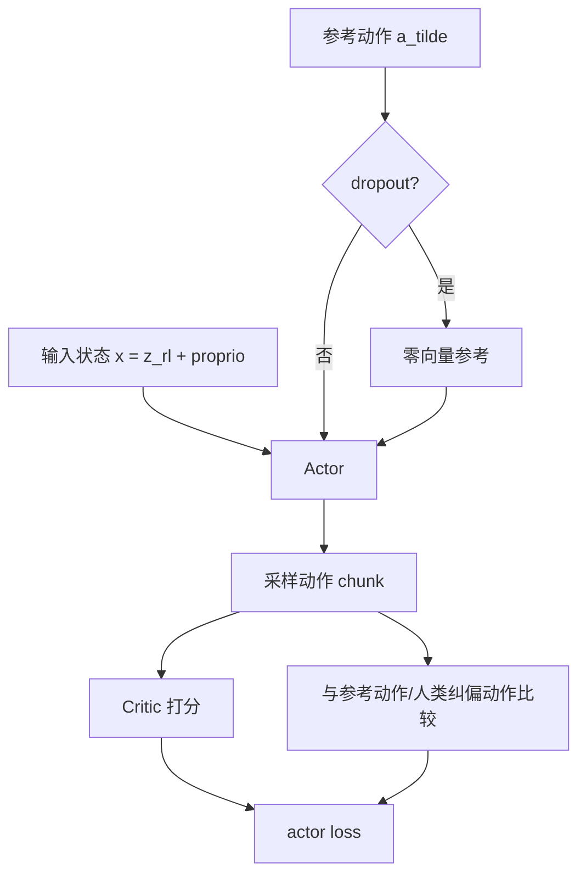

### 9. 为什么 RLT 适合真实机器人在线训练

论文之所以把 RLT 做成现在这个样子，本质上是在围绕真实机器人的三条约束做设计：

- 数据贵：每次 rollout 都要时间、人工和硬件损耗。
- 奖励稀疏：很多任务只能给终局成败标签。
- 训练窗口短：期望几分钟到几小时内看到提升。

对应的解决方式分别是：

- 用冻结 VLA + 小 actor-critic，降低参数规模和训练成本。
- 用 action chunk 缩短时域、提高 TD 学习效率。
- 用 VLA 参考动作和 BC 正则，把 RL 变成局部精修而不是全空间搜索。

这三点合在一起，才构成了 RLT 的样本效率来源。少了其中任意一块，方法都更容易退化成普通的“在机器人上硬跑 RL”。

### 10. 论文里的完整系统观

从系统角度看，论文里的训练流程可以分成四段：

1. 用任务数据训练 RL token，并可选地做少量 VLA 任务微调。
2. 用 base VLA 跑 warmup，先往 replay buffer 里放一批还算靠谱的数据。
3. 进入在线阶段：VLA 提供 `z_rl` 和参考动作，actor 输出 refined chunk，critic 用 replay 更新。
4. 人类在关键阶段提供成功/失败标签，必要时进行接管和纠偏。

论文还强调了一点：RLT 并不试图用 RL 重写整个长时任务，而是优先改进 critical phase，也就是最容易决定成败、同时最吃精度的那一小段。

这在真实机器人里很合理，因为：

- 非关键阶段，base VLA 常常已经够用。
- 真正值得花在线 RL 预算的，是接触、插入、旋拧、卡扣这类高敏感段落。

论文完整系统如果压成流程图，大致是下面这样：

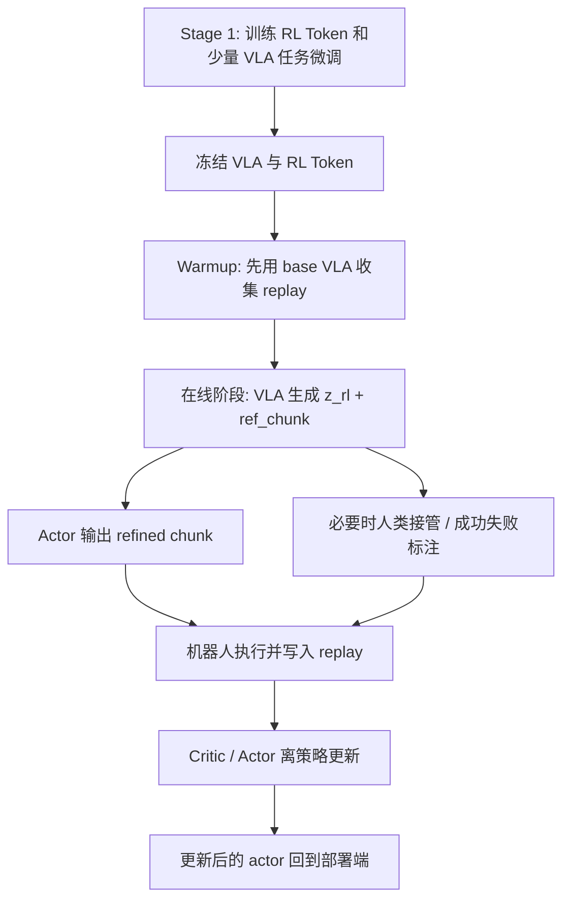

## 二、本仓库的工程实现

### 1. 总体定位

本仓库不是对论文的“逐行复刻”，而是一个基于 openpi 的 RLT 复现工程。根目录的 `README.md` 已经明确说明，它保留了 openpi 的主体训练与推理栈，再额外挂上：

- RL token 模块
- RLT 的训练入口
- VLA 远程服务
- 在线 actor-critic runtime
- replay、回放、机器人 rollout 和评估工具

从职责上可以把仓库拆成两层：

- 根目录 `src/openpi/`、`scripts/`：负责 RL token 训练、VLA 模型接线、远程推理服务。
- `rlt_online_rl/`：负责真实机器人上的在线 RL 运行时。

如果要理解全链路，建议把它看成 “Stage 1 离线准备 + Stage 2 在线学习” 两段式系统。

### 2. 仓库结构与阅读顺序

如果只想快速把主干看明白，推荐按下面顺序读：

1. `README.md`
2. `docs/rlt_stage1_training.md`
3. `scripts/train_rlt.py`
4. `scripts/serve_rlt_policy.py`
5. `rlt_online_rl/README.md`
6. `rlt_online_rl/src/rlt_online_rl/config.py`
7. `rlt_online_rl/src/rlt_online_rl/networks.py`
8. `rlt_online_rl/src/rlt_online_rl/trainer.py`
9. `rlt_online_rl/src/rlt_online_rl/replay.py`
10. `rlt_online_rl/src/rlt_online_rl/inference.py`

也可以按功能分目录理解：

- `src/openpi/models/rl_token.py`：RL token encoder/decoder 定义。
- `scripts/train_rlt.py`：Stage 1 训练入口。
- `scripts/serve_rlt_policy.py`：Machine A，提供 `z_rl` 和参考动作。
- `rlt_online_rl/src/rlt_online_rl/networks.py`：actor / critic 网络。
- `rlt_online_rl/src/rlt_online_rl/trainer.py`：在线 learner。
- `rlt_online_rl/src/rlt_online_rl/replay.py`：回放缓存与磁盘 journal。
- `rlt_online_rl/src/rlt_online_rl/inference.py`：actor service、Machine A client、rollout driver。
- `rlt_online_rl/scripts/run_online_rl.py`：运行时编排入口。
- `rlt_online_rl/configs/tasks/*`：任务级配置。
- `rlt_online_rl/train_deploy_alignment/`：真实机器人对接层。

### 3. Stage 1：RL token 训练是怎么接到 openpi 里的

#### 3.1 RL token 模块本身

`src/openpi/models/rl_token.py` 定义了三层对象：

- `RLTokenEncoder`
- `RLTokenDecoder`
- `RLTokenModel`

实现上和论文高度一致：

- encoder 从 VLA prefix embeddings 压缩出 RL token。
- decoder 从 RL token 重建 prefix embeddings。
- 训练目标是重建 MSE。

当前默认配置里，公开任务多使用：

- `num_rl_tokens = 1`
- `num_layers = 2`
- `embed_dim = 2048`
- `input_dim = 2048`

也就是说，本仓库通常把 RL token 做成一个单 token、等维压缩接口，而不是再额外把维度压得很小。

#### 3.2 训练入口与参数冻结策略

`scripts/train_rlt.py` 是 Stage 1 主入口。它做了三件关键的事：

- 用 `RLTTrainModel` 把 base VLA 和 RL token 模块包成一个联合模型。
- 根据 `rlt_alpha` 决定是否同时训练 VLA。
- 复用 openpi 原有的 optimizer、checkpoint、sharding 和数据管线。

这里最重要的是参数过滤策略：

- `alpha = 0` 时，只训练 `rlt_module`，VLA 参数冻结。
- `alpha > 0` 时，允许连 VLA 一起优化。

这对应论文里的 “只训练 RL token” 和 “联合少量任务微调” 两种模式。

#### 3.3 与 openpi / pi0 的接线关系

本仓库是基于 openpi 改出来的复现工程，不是直接复用论文里的原始 `pi0.6` 代码。工程上，RLT 是挂在 openpi 的 VLA 前缀表征之上的：

- `src/openpi/models/pi0.py` 负责 base VLA 的前缀与动作专家逻辑。
- `scripts/train_rlt.py` 会调用 `extract_prefix_embeddings` 或 `compute_loss_with_prefix`，从 VLA 中间表征上训练 RL token。

需要特别说明的是：

- 论文实验以 `pi0.6` 为基座。
- 本仓库 README 明确把自己定位成基于 openpi / pi0.5 路线的复现。

因此，理论主线一致，但底座模型并不是论文原版代码。

### 4. Stage 1 的产物：Machine A 为什么能同时返回 `z_rl` 和参考动作

`scripts/serve_rlt_policy.py` 实现的是论文里“冻结 VLA + RL token 模块”的在线推理服务，也就是运行时常说的 Machine A。

它的职责是：

- 读取训练好的 VLA + RL token checkpoint。
- 对输入观测做推理。
- 同时返回：
  - `z_rl`
  - `ref_chunk`

其中：

- `z_rl` 是 RL token 展平后的结果。
- `ref_chunk` 是 VLA 原生动作输出裁成当前在线 RL 需要的长度和维度。

这正好对应论文里的两个接口：

- 表征接口：给 RL 一个紧凑状态表示。
- 行为先验接口：给 actor 一个参考动作 chunk。

工程上，这一步很关键，因为它把“大模型推理”和“小模型在线学习”明确拆成了两个进程、两台机器也能跑。

对应到仓库实现，Machine A 的职责可以单独看成下面这张图：

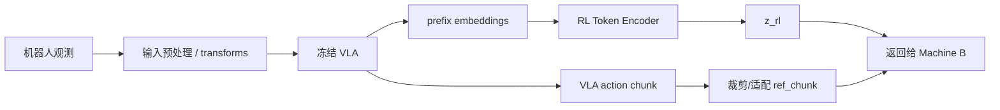

### 5. 在线运行时的总体架构

`rlt_online_rl/README.md` 对运行时做了比较清楚的划分，可以概括成四个角色：

- Machine A：冻结的 VLA / RL token 服务。
- B1 `actor_service`：对外提供当前 actor 参数下的动作 refinement。
- B2 `learner_service`：从 replay 采样并训练 actor / critic。
- B3 `replay_manager`：管理内存 replay 和磁盘 journal。
- B4 `EnvDriver`：连接机器人观测、Machine A、actor、replay 和人工信号。

从职责边界看，这个设计很成熟：

- 大模型和在线 RL 分离，便于资源隔离。
- actor serve 和 learner 分离，便于异步更新。
- rollout 和训练解耦，便于提高 update-to-data ratio。

论文强调的“异步 rollout + update”，在这里已经被真正做成了服务化结构。

这套服务关系建议直接对着下面这张架构图来看：

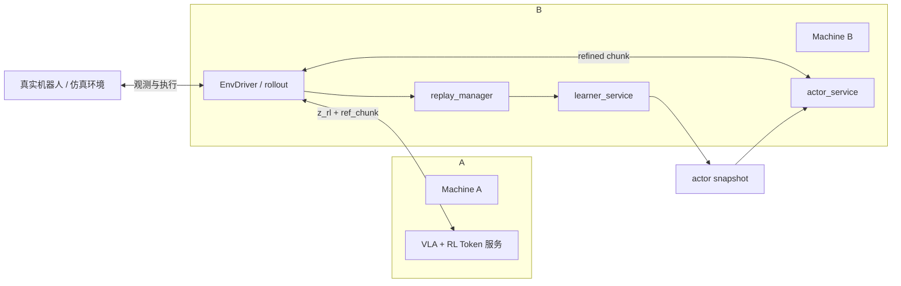

### 6. 每个 chunk 周期里，数据是怎么流动的

在线阶段的一次控制循环，可以按 `EnvDriver` 的逻辑理解：

1. 机器人读到当前观测。
2. `MachineAFeatureClient` 向 Machine A 请求特征。
3. Machine A 返回 `z_rl` 和 `ref_chunk`。
4. 本地从观测中截出 `proprio`。
5. `ActorClient` 请求 B1 actor service，得到 refined chunk。
6. 如果配置允许，人类 override 可以覆盖 actor 输出。
7. 机器人执行这段 chunk。
8. rollout driver 记录原始 step trace。
9. episode 结束后，再把 step trace 整理成 replay transition 写入 B3。
10. B2 learner 从 replay 采样，更新参数并导出最新 actor snapshot。
11. B1 轮询 snapshot，热更新到新 actor 参数。

这个流程和论文的算法框架基本同构，只不过代码里做得更细：

- 原始轨迹先落盘，再生成 replay。
- policy anchor 和 feature backfill 被显式实现出来。
- actor 服务和 learner 通过 snapshot 文件通信，而不是共享内存。

按一次 episode 内的时序看，运行逻辑更接近下面这样：

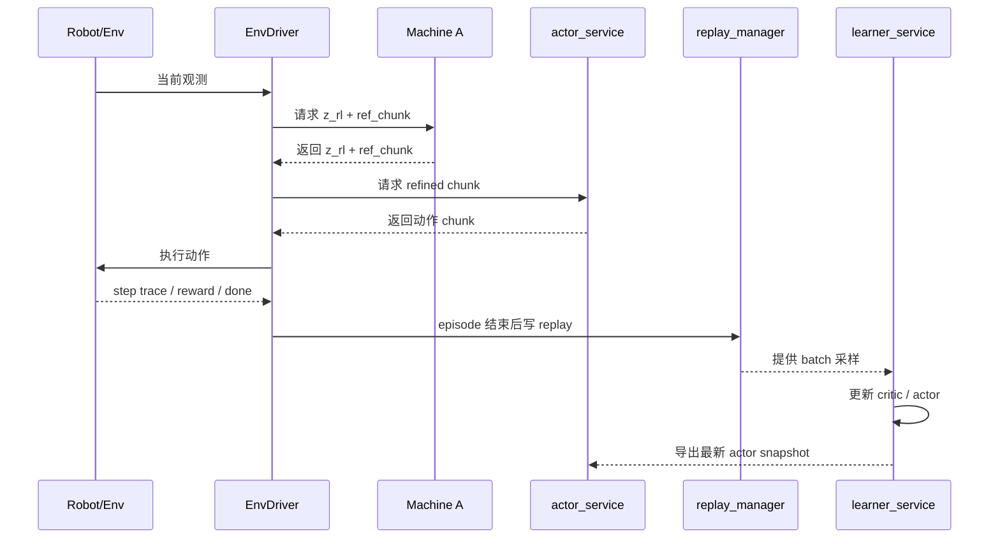

### 7. actor 和 critic 在仓库里具体长什么样

#### 7.1 Actor

`rlt_online_rl/src/rlt_online_rl/networks.py` 里的 `ChunkActor` 直接体现了论文的核心设计：

- 输入：`z_rl`、`proprio`、`ref_chunk`
- 输出：整个 action chunk 的均值
- 分布：固定方差高斯

编码方式比较朴素：

- `z_rl` 线性投影到 256 维。
- `proprio` 投影到 64 维。
- `ref_chunk` 展平后投影到 256 维。
- 三者拼接，过 MLP 输出完整 chunk。

也就是说，这里没有用复杂时序模型，完全符合论文“轻量 actor”的思路。

#### 7.2 Critic

`TwinCritic` 同样在 `networks.py` 里：

- 输入：`z_rl`、`proprio`、`action_chunk`
- 输出：两个 Q 值 `q1`、`q2`

这就是标准 twin critic 结构，和论文一致。

#### 7.3 训练目标

`rlt_online_rl/src/rlt_online_rl/trainer.py` 里，训练逻辑可以概括成：

- critic 每步都更新。
- actor 按 `actor_update_period` 更新，默认两次 critic 更新对应一次 actor 更新。
- actor 更新后，才软更新 target actor 和 target critic。

这和论文附录给出的 “two critic updates for each actor update” 是一致的工程化实现。

### 8. 本仓库里的训练目标，哪些和论文一致，哪些是工程扩展

#### 8.1 一致的部分

和论文主干一致的部分包括：

- off-policy actor-critic
- twin critic
- target network
- action chunk 级 TD 学习
- actor 条件在 `ref_chunk` 上
- BC 正则约束 actor 不要离参考动作太远
- reference dropout

#### 8.2 工程扩展的部分

本仓库在线 runtime 里还有几处明显的工程增强，这些不属于论文最核心的公式，但对真实机器人很重要。

#### `source_chunk` 驱动的 BC 目标切换

当 replay 中包含人类接管数据时，仓库不是始终拿 `ref_chunk` 做 BC 目标，而是按每个 step 的来源切换：

- 普通 policy / base 数据：对齐 `ref_chunk`
- HUMAN / MIXED 数据：对齐真实执行的 `action_chunk`

这相当于把“人类纠偏”也变成 actor 的监督信号。它比论文文字描述更细，也更贴近真实人机协作采集。

#### `delta_penalty`

当前实现里，actor loss 额外支持一个 `delta_penalty`：

- 先把训练动作还原到绝对动作 chunk。
- 再比较相邻步之间的 delta 是否平滑、是否贴近目标。

这不是论文公式中的主项，更像是为了真实机械臂执行稳定性加入的工程正则。

#### `action_representation`

论文主文讨论的是 chunk 动作学习，本仓库则进一步支持：

- `abs`
- `delta_chunk`

公开配置主要使用 `delta_chunk`。这说明仓库不是机械照搬论文动作空间，而是针对机器人控制特性做了归一化和增量动作表示适配。

### 9. Replay 在仓库里不是一个简单 buffer，而是一套“轨迹先存、再构造样本”的系统

论文中 replay buffer 是方法说明的一部分；在本仓库里，replay 被做成了完整的数据子系统。

#### 9.1 存储对象

`rlt_online_rl/src/rlt_online_rl/replay.py` 里定义了两层数据：

- `RawEpisodeTrace`：原始 episode 轨迹，包含 observation、step、chunk、anchor 等信息。
- `RLTTransition`：真正用于训练的 chunk-level transition。

这两层拆分很重要：

- 前者用于回放、检查、后处理和补特征。
- 后者才是 learner 实际采样的训练样本。

#### 9.2 为什么要先存 raw episode

真实机器人 rollout 时，很多信息在当下不一定都能立即整成训练样本：

- 人类何时接管、何时还给策略
- 哪些 step 属于关键阶段
- 是否需要补 Machine A 特征
- 末尾是否要补 terminal-aligned window

所以仓库选择：

- 先把完整 raw trace 保存下来
- episode 结束后统一构建 replay windows

这是一种更稳妥的真实机器人日志设计。

仓库里的 replay 不是“边执行边直接塞训练样本”，而是更接近两段式：

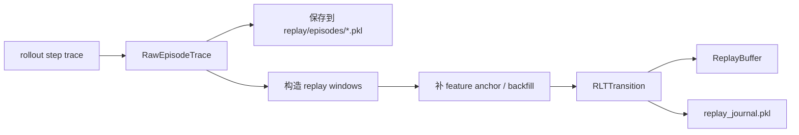

#### 9.3 回放窗口的构造方式

仓库支持两种 replay 构造方式：

- `step_trace_stride = 0`：chunk 边界模式
- `step_trace_stride > 0`：dense stride 模式

论文附录里强调了 stride=2 的 dense subsampling，这是其样本效率的重要来源之一。

但本仓库的当前公开配置，尤其是 `agilex_ethernet/online_rl.yaml`，默认用的是：

- `step_trace_stride: 0`

也就是说，公开工程默认并没有完全照论文那样做 dense stride replay，而是采用了 chunk 边界窗口。原因很可能是：

- 系统更稳，更容易调试
- 回放构造更直观
- 与当前部署流程更匹配

这属于“论文思想保留，但实现策略做了保守化”的典型例子。

如果只关心两种 replay 模式的区别，可以直接看这个对比：

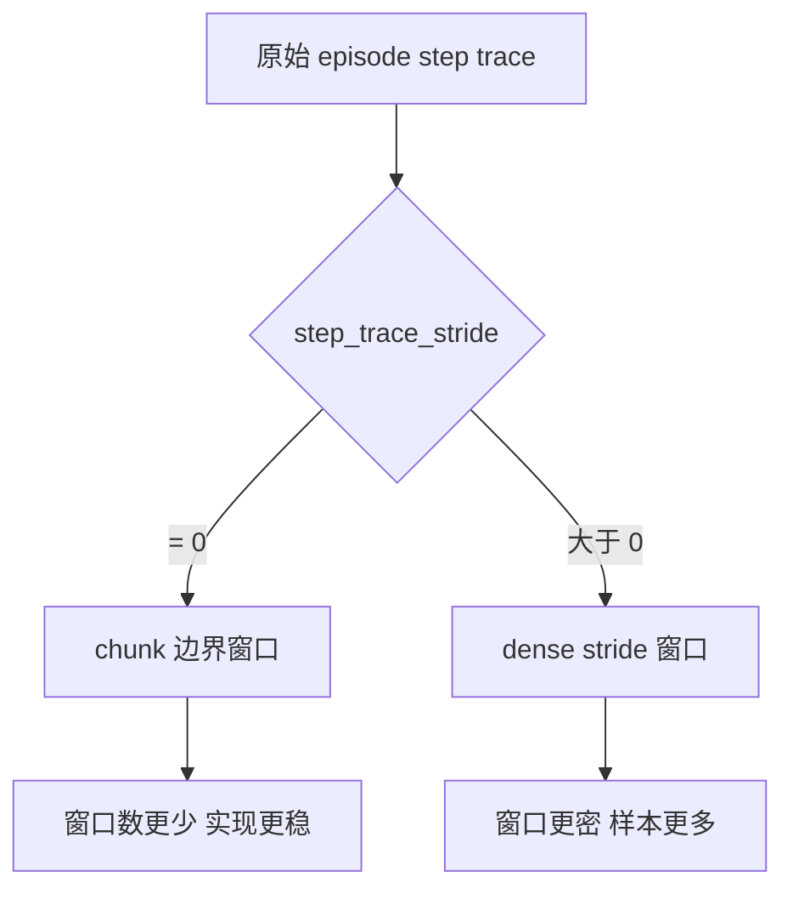

#### 9.4 磁盘 journal

`ReplayManager` 会把每条 transition 追加写入 `replay_journal.pkl`。它的作用有三个：

- 进程重启后恢复 replay buffer
- 留下离线分析入口
- 形成可审计的数据记录

这也是为什么 `runs/<task>/replay/` 往往是 run 目录里最值得保留的部分。

### 10. Warmup、online、critical phase 在仓库里怎么落地

论文里这些概念在仓库中都有明确状态机。

#### Warmup

learner 会先等 replay 大小达到 `warmup_min_size`，然后才开始真正有意义的学习。当前公开配置通常还会设置：

- `warmup_post_collect_updates`

它表示 warmup 数据收集完后，还要额外做一段 learner update，达到“可以上线”的程度后，actor 才会介入机器人控制。

#### Critical phase

仓库明确支持：

- `full_task`
- `critical_phase`

这和论文“先改关键阶段，再推广到全任务”的做法是一致的。真实部署里，这一点非常实用，因为它直接降低了训练难度和 reset 成本。

#### Human override

论文里提到 human intervention，本仓库则把它做成了完整接口：

- rollout 中允许人工覆盖 actor 输出
- replay 里保留 intervention 标记
- 训练采样时还能提高 human intervention 数据占比

这使仓库不只是“能跑 RL”，而是“能跑带人工纠偏的真实机器人 RL”。

### 11. 配置层反映了这是一套可部署系统，而不只是论文代码

`rlt_online_rl/src/rlt_online_rl/config.py` 把系统拆成五类配置：

- `RLTOnlineRLConfig`
- `ActorServiceConfig`
- `LearnerServiceConfig`
- `ReplayConfig`
- `EnvDriverConfig`

这五类配置对应的不是单个模型，而是整条在线运行链路。

从这里也能看出本仓库与论文实现的一个重要区别：论文描述的是方法，本仓库实现的是一个可长期运行、可恢复、可观测、可部署的服务系统。

例如配置里明确包含：

- 网络地址
- 服务端口
- snapshot 路径
- checkpoint 路径
- replay journal 路径
- 控制频率
- 动作表示
- 人工接管开关

这部分内容本身不是“算法创新”，但它决定了系统能不能在真实机器人上稳定跑起来。

配置层和运行产物之间的关系可以概括成下面这张图：

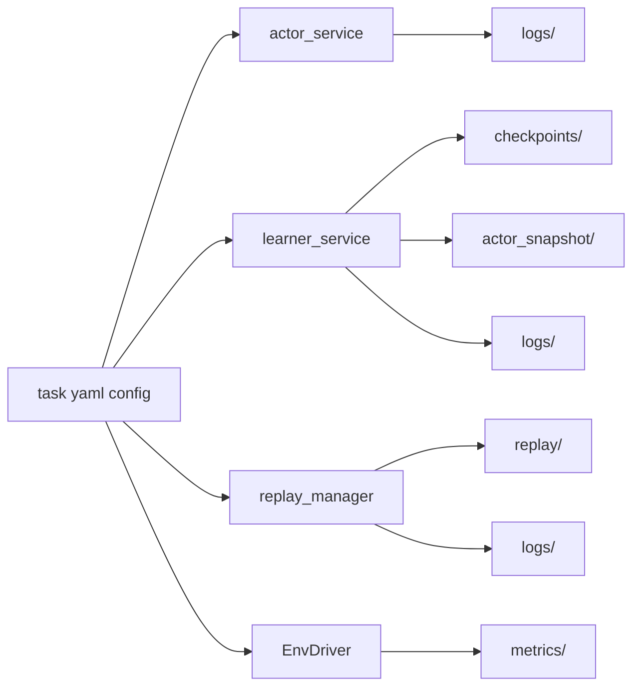

### 12. 论文设定与本仓库公开实现的几个关键差异

这是阅读仓库时最容易混淆的地方，最好单独列出来。

#### 12.1 底座模型不同

- 论文主文使用的是 `pi0.6`
- 本仓库定位为基于 openpi / pi0.5 路线的 RLT 复现

#### 12.2 公开任务配置不完全一致

论文附录中常见设定包括：

- 控制频率 50 Hz
- RL chunk 长度 `C = 10`
- stride = 2 的稠密 replay

本仓库公开配置则更灵活：

- `agilex_ethernet` 当前配置是 `chunk_len=10`、`control_frequency_hz=20.0`
- `dobot_umi` 当前配置是 `chunk_len=50`、`control_frequency_hz=30.0`
- 两个公开配置默认都是 `step_trace_stride=0`

这说明仓库并没有强行把论文超参数固定死，而是按具体机器人和任务做了工程适配。

#### 12.3 动作表示做了工程增强

论文主线只强调 chunk 级 RL；本仓库在此基础上增加了：

- `delta_chunk` 动作表示
- 动作归一化统计量
- `delta_penalty`

这些都更偏机器人控制稳定性，而不是论文方法本身不可缺少的部分。

#### 12.4 Replay 与人工干预处理更完整

论文描述了 replay、human intervention 和 critical phase handoff 的思想；本仓库则把这些内容都做成了可追踪的运行时机制，包括：

- 原始 episode 落盘
- append-only journal
- feature anchor 缓存
- HUMAN / MIXED source 标记
- 人工接管样本重加权采样

这部分是仓库工程价值很高的一块。

### 13. 运行产物应该怎么理解

一个典型 run 目录一般包括：

- `actor_snapshot/`
- `checkpoints/`
- `logs/`
- `metrics/`
- `replay/`

它们各自对应的含义是：

- `actor_snapshot/`：当前 actor 可部署快照，以及可选历史版本。
- `checkpoints/`：learner 训练状态，可恢复在线训练。
- `logs/`：各服务日志。
- `metrics/`：训练与 rollout 指标。
- `replay/`：最核心的数据资产，包含训练 journal 和原始 episode。

从研究和复现实验的角度，`replay/` 与 `checkpoints/latest.pkl` 通常是最关键的。

### 14. 对这套仓库的一个整体判断

如果只看算法，这个仓库做的事情可以概括成一句话：

- 把论文中的 RL token + reference-conditioned actor-critic 主线，移植到了 openpi 体系，并围绕真实机器人部署补齐了服务、日志、回放和人工接管机制。

如果从工程角度看，它的价值主要不在于“提出了一个新的公式”，而在于把以下几件本来分散的东西串成了一条闭环：

- RL token 训练
- 冻结 VLA 远程服务
- 轻量 actor-critic 在线更新
- replay 落盘与恢复
- 真实机器人 rollout
- critical phase 训练
- human-in-the-loop 纠偏

也正因为如此，阅读这个仓库时最好的心态不是把它当成“论文附录代码”，而是把它当成一套已经服务化、运行时化的 RLT 复现实验平台。

## 参考资料

- 论文：*RL Token: Bootstrapping Online RL with Vision-Language-Action Models*，Physical Intelligence，2026。
- 仓库根说明：`README.md`
- 在线运行时说明：`rlt_online_rl/README.md`
- 现有补充文档：
  - `docs/rlt_stage1_training.md`
  - `docs/online_rl_pipeline.md`
  - `docs/q_value_and_twin_critic.md`
  - `rlt_online_rl/docs/actor_critic_training_explained.md`
