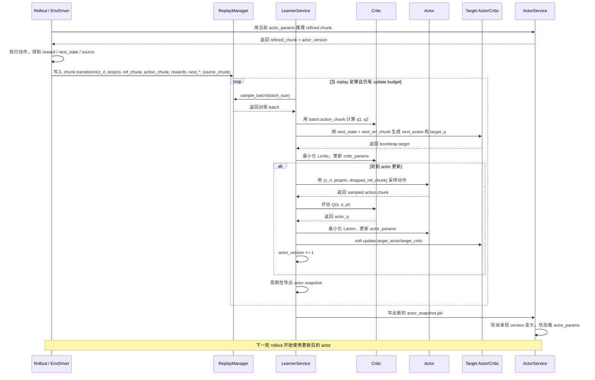

# Actor-Critic 协同训练与参数更新梳理

这份文档解释当前 `rlt_online_rl` 里的 actor-critic 是如何协同训练的，重点回答两个问题：

1. actor 和 critic 分别学什么
2. rollout 结束后，参数是按什么顺序更新的

文中引用的代码路径都来自当前仓库版本。

## 1. 整体结论

这套实现里的训练闭环可以先概括成一句话：

- `rollout` 负责产出 `(状态, 参考动作, 实际执行动作, reward, next_state)`
- `critic` 先学习“这段动作 chunk 在当前状态下值多少钱”
- `actor` 再利用 `critic` 的打分，学习“在尽量贴近参考动作或人类修正的前提下，生成更高 Q 的动作 chunk”

所以它不是一个“actor 单独学、critic 单独学”的结构，而是：

- critic 给 actor 提供优化方向
- actor 更新后再回到 rollout 继续收集新数据
- 新数据继续反过来更新 critic

这是一个闭环。

## 2. 训练入口在哪里

训练进程是 `learner_service`，启动入口在 [rlt_online_rl/scripts/run_online_rl.py](/home/lry/src/lry/lry-openpi-RLT/rlt_online_rl/scripts/run_online_rl.py:155)。

`_run_learner_service()` 做了三件事：

- 创建 `ReplayClient`
- 创建 `LearnerService`
- 调用 `learner.run_forever()`

也就是说，真正的训练主循环都在 `LearnerService` 里。

一次训练发生在 [rlt_online_rl/src/rlt_online_rl/trainer.py](/home/lry/src/lry/lry-openpi-RLT/rlt_online_rl/src/rlt_online_rl/trainer.py:478) 的 `LearnerService.train_once()`：

1. 读取 replay 当前统计信息
2. 判断 warmup 是否达标
3. 判断当前是否还有 update budget
4. 从 replay 采一个 batch
5. 调 `train_step(...)`
6. 记录 metrics、保存 checkpoint、导出 actor snapshot

核心训练逻辑在 [trainer.py](/home/lry/src/lry/lry-openpi-RLT/rlt_online_rl/src/rlt_online_rl/trainer.py:283) 的 `train_step()`。

## 3. replay 里的训练样本长什么样

训练样本不是单步 transition，而是一个 chunk-level transition。

构造逻辑在 [rlt_online_rl/src/rlt_online_rl/replay.py](/home/lry/src/lry/lry-openpi-RLT/rlt_online_rl/src/rlt_online_rl/replay.py:279) 的 `_build_chunk_transition()`。

每条样本主要包含：

- `z_rl`, `proprio`：当前状态特征
- `ref_chunk`：当前窗口里的参考动作 chunk
- `action_chunk`：当前窗口里实际执行的动作 chunk
- `rewards`：这个 chunk 内每一步 reward
- `done`
- `next_z_rl`, `next_proprio`
- `next_ref_chunk`
- `source_chunk`：这个 chunk 每一步动作来自 `BASE / RL / HUMAN / MIXED` 的哪一种

对应构造位置见 [replay.py:295-319](/home/lry/src/lry/lry-openpi-RLT/rlt_online_rl/src/rlt_online_rl/replay.py:295)。

这一步决定了后面 actor 和 critic 的分工：

- critic 用 `action_chunk` 学“执行过的动作到底好不好”
- actor 用 `ref_chunk` 学“如何基于参考动作做 refinement”
- `source_chunk` 决定 actor 的监督目标到底对齐参考动作还是人类动作

## 4. actor 网络学什么

actor 定义在 [rlt_online_rl/src/rlt_online_rl/networks.py](/home/lry/src/lry/lry-openpi-RLT/rlt_online_rl/src/rlt_online_rl/networks.py:53) 的 `ChunkActor`。

它的输入是：

- `z_rl`
- `proprio`
- `ref_chunk`

在 [networks.py:76-88](/home/lry/src/lry/lry-openpi-RLT/rlt_online_rl/src/rlt_online_rl/networks.py:76) 里，这三部分分别编码后再拼接。

输出是：

- 一个动作 chunk 的均值 `mu`
- 固定标准差 `fixed_std`

采样逻辑在 [networks.py:113-127](/home/lry/src/lry/lry-openpi-RLT/rlt_online_rl/src/rlt_online_rl/networks.py:113)。

所以 actor 不是无条件生成动作，而是一个：

- `reference-conditioned actor`

更准确地说，它学的是：

- 给定当前状态和 `ref_chunk`
- 产出一个“修正后的 chunk 动作”

## 5. critic 网络学什么

critic 定义在 [rlt_online_rl/src/rlt_online_rl/networks.py](/home/lry/src/lry/lry-openpi-RLT/rlt_online_rl/src/rlt_online_rl/networks.py:166) 的 `TwinCritic`。

它有两个 Q 网络：

- `q1`
- `q2`

单个 Q 网络 `QNetwork` 的输入是：

- `z_rl`
- `proprio`
- `action_chunk`

定义见 [networks.py:130-163](/home/lry/src/lry/lry-openpi-RLT/rlt_online_rl/src/rlt_online_rl/networks.py:130)。

因此 critic 学的是：

- 在状态 `s` 下，某个 chunk 动作 `a_chunk` 的价值 `Q(s, a_chunk)`

这里采用 twin critic，是为了降低 Q 的高估偏差。

## 6. train state 里保存了哪些参数

训练状态定义在 [rlt_online_rl/src/rlt_online_rl/trainer.py](/home/lry/src/lry/lry-openpi-RLT/rlt_online_rl/src/rlt_online_rl/trainer.py:51) 的 `RLTTrainState`：

- `actor_params`
- `target_actor_params`
- `critic_params`
- `target_critic_params`
- `actor_opt_state`
- `critic_opt_state`
- `rng`
- `global_step`
- `actor_version`

初始化在 [trainer.py:88-112](/home/lry/src/lry/lry-openpi-RLT/rlt_online_rl/src/rlt_online_rl/trainer.py:88)：

- actor 和 critic 各初始化一份 online 参数
- target 参数初始时直接拷贝 online 参数
- actor 和 critic 都使用 Adam

## 7. 一次 train_step 里谁先更新

`train_step()` 在 [trainer.py:283-359](/home/lry/src/lry/lry-openpi-RLT/rlt_online_rl/src/rlt_online_rl/trainer.py:283)。

顺序非常明确：

1. 先 `update_critic(...)`
2. 再判断这一轮是否轮到 actor 更新
3. 如果轮到 actor 更新，再做 `update_actor(...)`
4. 只有 actor 更新发生时，才软更新 target actor 和 target critic
5. 最后 `global_step += 1`

代码上的关键判断在 [trainer.py:298-299](/home/lry/src/lry/lry-openpi-RLT/rlt_online_rl/src/rlt_online_rl/trainer.py:298)：

```python
state, critic_metrics = update_critic(state, batch, actor, critic, rl_config)
should_update_actor = ((state.global_step + 1) % rl_config.actor_update_period) == 0
```

也就是说：

- critic 每一步都更新
- actor 每 `actor_update_period` 步更新一次

默认 `actor_update_period=2`，配置在 [rlt_online_rl/src/rlt_online_rl/config.py](/home/lry/src/lry/lry-openpi-RLT/rlt_online_rl/src/rlt_online_rl/config.py:42)。

测试也验证了这一点，见 [rlt_online_rl/tests/test_trainer.py](/home/lry/src/lry/lry-openpi-RLT/rlt_online_rl/tests/test_trainer.py:75)。

## 8. critic 是怎么更新的

critic 更新入口在 [trainer.py:132-172](/home/lry/src/lry/lry-openpi-RLT/rlt_online_rl/src/rlt_online_rl/trainer.py:132)。

它内部调用 [rlt_online_rl/src/rlt_online_rl/networks.py](/home/lry/src/lry/lry-openpi-RLT/rlt_online_rl/src/rlt_online_rl/networks.py:278) 的 `compute_critic_loss()`。

### 8.1 当前 Q 的计算

先用当前 critic 参数计算：

- `q1 = Q1(s, action_chunk)`
- `q2 = Q2(s, action_chunk)`

这里的 `action_chunk` 是 replay 里真实执行过的动作。

### 8.2 TD target 的计算

TD target 在 [networks.py:226-249](/home/lry/src/lry/lry-openpi-RLT/rlt_online_rl/src/rlt_online_rl/networks.py:226) 的 `build_td_target()` 里构造。

步骤是：

1. 用 `target_actor` 在 `next_state` 和 `next_ref_chunk` 上采样出 `next_action`
2. 用 `target_critic` 计算 `next_q1, next_q2`
3. 取 `min(next_q1, next_q2)` 做 bootstrap
4. 把当前 chunk 内的 reward 做折扣求和
5. 再加上 bootstrap 项

对应公式可以写成：

```text
target_q = sum_t gamma^t * reward_t + (1 - done) * gamma^H * min(target_q1, target_q2)
```

其中：

- `H = chunk_len`

### 8.3 critic loss

critic loss 是：

```text
Lcritic = MSE(q1, target_q) + MSE(q2, target_q)
```

见 [networks.py:299-304](/home/lry/src/lry/lry-openpi-RLT/rlt_online_rl/src/rlt_online_rl/networks.py:299)。

### 8.4 critic 参数更新

更新步骤在 [trainer.py:160-166](/home/lry/src/lry/lry-openpi-RLT/rlt_online_rl/src/rlt_online_rl/trainer.py:160)：

1. `jax.value_and_grad(loss_fn, has_aux=True)`
2. `critic_tx.update(...)`
3. `optax.apply_updates(...)`

所以 critic 是标准的梯度下降更新。

## 9. actor 是怎么更新的

actor 更新在 [trainer.py:175-280](/home/lry/src/lry/lry-openpi-RLT/rlt_online_rl/src/rlt_online_rl/trainer.py:175)。

它和 critic 不一样，不是直接拿 replay 里的 `action_chunk` 回归，而是先自己生成候选动作，再让 critic 给分。

### 9.1 actor 先生成动作

actor 更新时先做两步：

1. 对 `ref_chunk` 做 reference dropout
2. 用 actor 采样得到新的 `action_chunk`

对应代码在 [trainer.py:192-205](/home/lry/src/lry/lry-openpi-RLT/rlt_online_rl/src/rlt_online_rl/trainer.py:192)。

reference dropout 实现在 [networks.py:210-218](/home/lry/src/lry/lry-openpi-RLT/rlt_online_rl/src/rlt_online_rl/networks.py:210)。

它的目的不是 regularization 的教科书意义那么简单，而是更偏工程语义：

- 不让 actor 过度依赖 reference
- 逼它在 reference 缺失或不可靠时仍然学会利用状态信息修正动作

### 9.2 critic 给 actor 当前动作打分

actor 采样出动作后，调用：

- `critic.q_values(state.critic_params, ...)`

见 [trainer.py:206-211](/home/lry/src/lry/lry-openpi-RLT/rlt_online_rl/src/rlt_online_rl/trainer.py:206)。

注意这里用的是：

- 当前 critic 参数 `state.critic_params`

不是 target critic。

这就说明 actor 的优化方向来自“当前 critic 对当前策略动作的判断”。

### 9.3 actor loss 的三部分

actor loss 在 [trainer.py:249-252](/home/lry/src/lry/lry-openpi-RLT/rlt_online_rl/src/rlt_online_rl/trainer.py:249)：

```text
actor_loss = bc_weight * bc_penalty - q_weight * actor_q + delta_weight * delta_penalty
```

这三项分别代表：

- `bc_penalty`
  约束 actor 不要偏离监督目标太远
- `- actor_q`
  鼓励 actor 产生更高价值的动作
- `delta_penalty`
  约束 chunk 内相邻步之间的动作变化形状

因此 actor 不是单纯 imitation，也不是纯 policy gradient，而是：

- “模仿约束 + critic 引导”的折中优化

## 10. BC target 为什么有时对齐 ref，有时对齐 human action

这是整个实现里最关键的点之一。

逻辑在 [trainer.py:212-225](/home/lry/src/lry/lry-openpi-RLT/rlt_online_rl/src/rlt_online_rl/trainer.py:212)。

先根据 `source_chunk` 构造 `human_mask`：

- `HUMAN`
- `MIXED`

都视为 human 区域。

然后 BC target 定义为：

```python
bc_target = jnp.where(human_mask[..., None], batch["action_chunk"], batch["ref_chunk"])
```

见 [trainer.py:219](/home/lry/src/lry/lry-openpi-RLT/rlt_online_rl/src/rlt_online_rl/trainer.py:219)。

这意味着：

- 如果这一段是 policy/base 自己执行的，就向 `ref_chunk` 对齐
- 如果这一段有人类接管或混合控制，就向实际执行的 `action_chunk` 对齐

这个设计非常重要，因为它表示 actor 学的不是“盲目模仿执行动作”，而是：

- 正常数据里学会跟随参考动作
- 人类干预数据里学会把参考动作修正到人类真实执行的更优版本

测试也明确验证了这件事，见 [rlt_online_rl/tests/test_trainer.py](/home/lry/src/lry/lry-openpi-RLT/rlt_online_rl/tests/test_trainer.py:85)。

## 11. delta_penalty 是怎么回事

`delta_penalty` 在 [trainer.py:227-247](/home/lry/src/lry/lry-openpi-RLT/rlt_online_rl/src/rlt_online_rl/trainer.py:227) 计算。

逻辑是：

1. 如果训练动作表示不是绝对动作，需要先反归一化回可执行绝对动作
2. 取 chunk 内相邻两步的差分
3. 比较预测动作和目标动作的差分误差

代码上当前只比较前 6 个关节：

```python
pred_step_delta = pred_abs_chunk[:, 1:, :6] - pred_abs_chunk[:, :-1, :6]
target_step_delta = target_abs_chunk[:, 1:, :6] - target_abs_chunk[:, :-1, :6]
```

这项约束的直观作用是：

- 减少 chunk 内动作形状抖动
- 让修正后的动作更接近示范的时序变化模式

## 12. target network 是什么时候更新的

这份代码里，target network 并不是每次 critic 更新后都更新。

只有当 actor 更新发生时，才同时软更新：

- `target_actor_params`
- `target_critic_params`

见 [trainer.py:315-339](/home/lry/src/lry/lry-openpi-RLT/rlt_online_rl/src/rlt_online_rl/trainer.py:315)。

软更新公式定义在 [trainer.py:115-118](/home/lry/src/lry/lry-openpi-RLT/rlt_online_rl/src/rlt_online_rl/trainer.py:115)：

```text
target = (1 - tau) * target + tau * source
```

其中 `tau` 默认是 `5e-3`，配置在 [rlt_online_rl/src/rlt_online_rl/config.py](/home/lry/src/lry/lry-openpi-RLT/rlt_online_rl/src/rlt_online_rl/config.py:42)。

所以参数更新节奏可以理解成：

- critic 每步学
- actor 隔几步学
- target 跟着 actor 更新节奏慢慢追 online 网络

## 13. actor_version 和 snapshot 是怎么推进的

每当 actor 真正更新一次，`actor_version` 就会加一，见 [trainer.py:335-338](/home/lry/src/lry/lry-openpi-RLT/rlt_online_rl/src/rlt_online_rl/trainer.py:335)。

之后 `LearnerService` 会周期性导出 snapshot，见 [trainer.py:581-620](/home/lry/src/lry/lry-openpi-RLT/rlt_online_rl/src/rlt_online_rl/trainer.py:581)。

snapshot 里主要保存：

- `version`
- `global_step`
- `rl_config`
- `actor_params`

也就是说：

- rollout 端真正在线上使用的是 actor snapshot
- critic 参数不会被 rollout 直接拿去推理

## 14. rollout 怎么拿到新 actor

actor service 定义在 [rlt_online_rl/src/rlt_online_rl/inference.py](/home/lry/src/lry/lry-openpi-RLT/rlt_online_rl/src/rlt_online_rl/inference.py:281)。

它会：

1. 启动时先加载一次 snapshot
2. 后台轮询 snapshot 文件
3. 如果发现版本号变大，就热加载新的 `actor_params`

关键逻辑在 [inference.py:437-467](/home/lry/src/lry/lry-openpi-RLT/rlt_online_rl/src/rlt_online_rl/inference.py:437)。

所以训练后不是直接把 actor 内存传给 rollout，而是通过：

- learner 导出 snapshot
- actor service 轮询加载 snapshot

来完成参数同步。

## 15. warmup 和 online 阶段有什么区别

算法主体没有变，主要变的是 actor loss 的权重。

权重切换逻辑在 [trainer.py:121-129](/home/lry/src/lry/lry-openpi-RLT/rlt_online_rl/src/rlt_online_rl/trainer.py:121)：

- warmup 期间使用 `warmup_bc_weight` 和 `warmup_q_weight`
- online 期间使用 `online_bc_weight` 和 `online_q_weight`

配置项定义在 [rlt_online_rl/src/rlt_online_rl/config.py](/home/lry/src/lry/lry-openpi-RLT/rlt_online_rl/src/rlt_online_rl/config.py:26)。

这表示：

- warmup 可以更偏向模仿和稳定训练
- online 可以更强调 critic 引导下的性能提升

## 16. learner 为什么不会无限训练

这是由 update budget 控制的。

逻辑在 [trainer.py:698-744](/home/lry/src/lry/lry-openpi-RLT/rlt_online_rl/src/rlt_online_rl/trainer.py:698)。

大意是：

- replay 到达 `warmup_min_size` 时，锁定一个 warmup 起点
- 然后根据 `grad_updates_per_cycle` 计算“当前一共允许做多少次梯度更新”
- 如果 `global_step` 已经追上允许的总更新数，learner 就暂停，等新数据进来

默认：

- 每新增 1 条 replay 样本，允许做 `grad_updates_per_cycle=5` 次梯度更新

定义在 [rlt_online_rl/src/rlt_online_rl/config.py](/home/lry/src/lry/lry-openpi-RLT/rlt_online_rl/src/rlt_online_rl/config.py:49)。

所以这套系统是：

- 数据驱动训练推进
- 不是空转刷梯度

## 17. 用一句话总结 actor 和 critic 的协同关系

最准确的说法是：

- critic 从 replay 里的真实执行结果学习价值函数
- actor 在参考动作条件下生成候选动作
- critic 给 actor 候选动作打分
- actor 在“更高 Q”和“别偏离参考/人类修正太远”之间做折中优化
- 更新后的 actor 再被 rollout 使用，产出下一轮数据

因此这里的 actor-critic 不是标准无条件策略学习，而是：

- 一个 reference-conditioned refinement actor
- 配一个用真实 chunk 回报训练的 twin critic

## 18. 最核心的参数更新公式

如果只保留最关键的数学关系，可以记下面四条。

### 18.1 critic 更新

```text
q1, q2 = critic(s, a_exec)
target = discounted_rewards + gamma^H * min(target_critic(s', target_actor(s')))
Lcritic = MSE(q1, target) + MSE(q2, target)
```

### 18.2 actor 生成候选动作

```text
a_pi ~ actor(s, ref_chunk)
```

### 18.3 actor 更新

```text
Lactor = bc_weight * ||a_pi - bc_target||^2 - q_weight * Q1(s, a_pi) + delta_weight * delta_penalty
```

### 18.4 target 软更新

```text
theta_target <- (1 - tau) * theta_target + tau * theta_online
```

## 19. 从实现角度看，一次训练步到底发生了什么

可以把单次 `train_step()` 近似理解为下面的伪代码：

```python
batch = replay.sample()

# 1. critic update
target_q = discounted_rewards + bootstrap_from_target_networks
critic_loss = mse(q1, target_q) + mse(q2, target_q)
critic_params = adam_update(critic_params, grad(critic_loss))

# 2. actor update every N steps
if (global_step + 1) % actor_update_period == 0:
    sampled_action = actor(z_rl, proprio, dropped_ref_chunk)
    actor_q = critic(sampled_action)
    bc_target = human ? executed_action_chunk : ref_chunk
    actor_loss = bc_weight * bc_penalty - q_weight * actor_q + delta_weight * delta_penalty
    actor_params = adam_update(actor_params, grad(actor_loss))

    target_actor_params = soft_update(target_actor_params, actor_params)
    target_critic_params = soft_update(target_critic_params, critic_params)
    actor_version += 1

global_step += 1
```

这个伪代码和真实实现基本是一一对应的。

## 20. 从 rollout 到 replay 到 critic 到 actor 到 snapshot 到下一轮 rollout 的时序图



